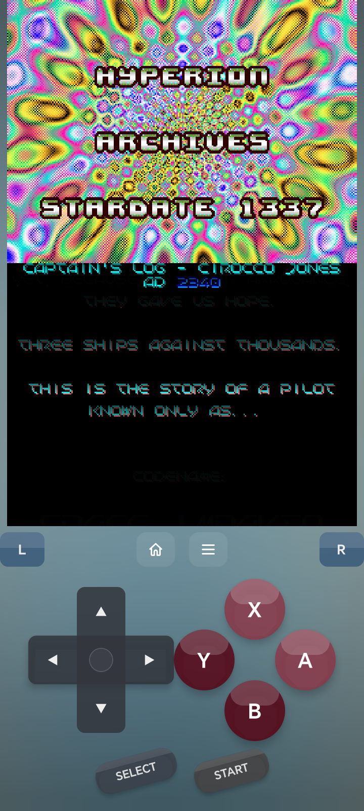
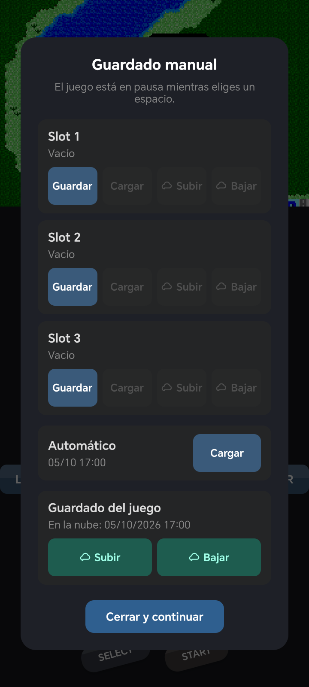
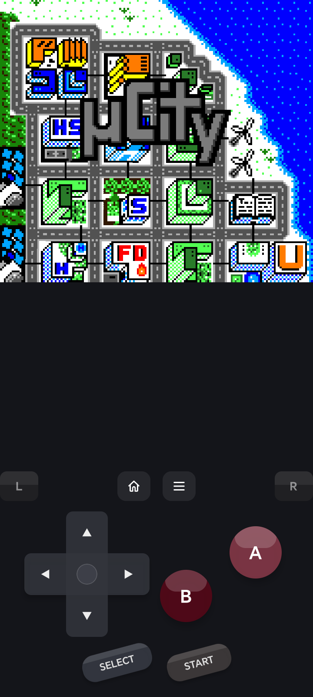
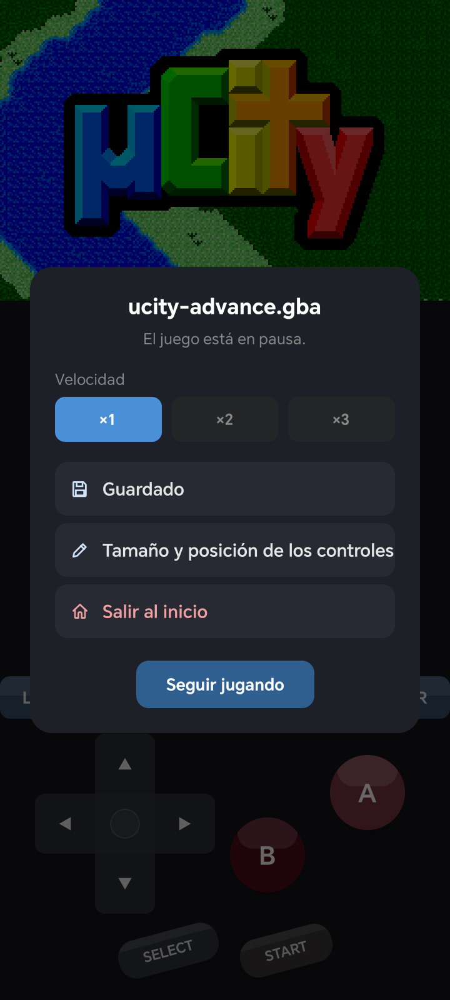
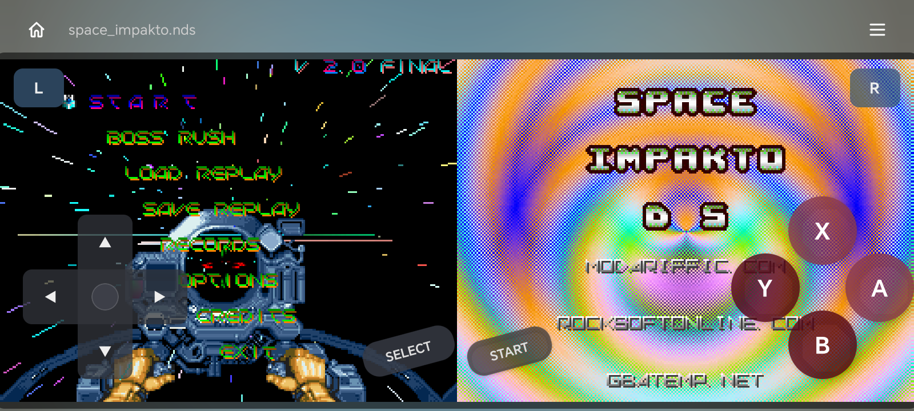

# multiemu

**English** · [Español](README.es.md)

[](LICENSE)


**multiemu is a free, open-source Android emulator for Game Boy, Game Boy Color, Game Boy Advance, Nintendo DS and Nintendo 3DS in a single app.**

- **Systems:** Game Boy / Game Boy Color, Game Boy Advance, Nintendo DS, Nintendo 3DS.
- **Cloud saves:** sign in with a free RomHack Hub account and your GBA, DS and 3DS game saves sync on their own between your phone and the Windows app; save states can be uploaded and downloaded per slot.
- **3DS local wireless over the internet:** join one of the rooms on the project's room server and a 3DS game's local wireless (trades, battles) sees the other consoles in that room, phone to phone or phone to PC.
- **Its own Game Boy core:** GB/GBC run on a core written from scratch for this project (`core/gb`); GBA, DS and 3DS use mGBA, melonDS and Azahar.
- Save states with an automatic slot, on-screen controls you can move and resize, console themes, 1×–3× speed.

**Download:** <https://www.emulatornds.online/app> — Android 9 or later (3DS needs a 64-bit ARM phone). The app checks for updates itself.

> multiemu does **not** include any game, BIOS or firmware, and never will. Use dumps of games you own.

## Screenshots

<p>
  
  
  
  
</p>
<p>
  
</p>

The games shown are free homebrew, not Nintendo games: [µCity](https://github.com/AntonioND/ucity) (GBC, GPLv3+, art CC BY-SA 4.0) and [µCity Advance](https://codeberg.org/SkyLyrac/ucity-advance) (GBA, GPL-3.0, art CC BY-NC-SA 4.0) by Antonio Niño Díaz, and [Space Impakto DS](https://github.com/AntonioND/SpaceImpakto-DS) by Richard Eric M. Lope (MIT). None of them is included in the app.

## Verify the APK

Every release from 1.14 on is signed only with this certificate (APK Signature Scheme v3):

```
SHA-256: 36:6b:da:3a:15:d1:63:2c:da:04:64:e8:4a:b3:af:4d:2c:a9:b6:6c:e7:ae:5f:b0:58:5b:92:19:5b:5e:b4:41
```

Check a downloaded APK with `apksigner` from the Android SDK build-tools:

```bash
apksigner verify --print-certs multiemu-1.16.apk
```

The line `Signer #1 certificate SHA-256 digest:` must read `366bda3a15d1632cda0464e84ab3af4d2ca9b66ce7ae5fb0585b92195b5eb441`. On the phone, apps such as [AppVerifier](https://github.com/soupslurpr/AppVerifier) show the same fingerprint for an installed app.

The signing key was rotated in October 2026 (see [docs/signing.md](docs/signing.md)). The new key carries a signed proof that it replaces the old one (`ee73fd3b…`), so Android 9+ installs it as an update without uninstalling. Android 7–8 stay on 1.13.

## Build from source

You need Node.js 22.11+, JDK 17, the Android SDK (compile SDK 37) with NDK `29.0.14206865`, CMake 3.25+ and Ninja.

1. JavaScript dependencies:
   ```bash
   cd app && npm ci
   ```
2. Native cores. `third_party/` is not versioned; each core is cloned at a pinned tag, our patches from `patches/` are applied, and it is built once outside Gradle:
   - mGBA 0.10.5 — [docs/mgba-setup.md](docs/mgba-setup.md)
   - melonDS 1.1 + `patches/melonds` — [docs/melonds-setup.md](docs/melonds-setup.md)
   - Azahar 2126.1.2 + `patches/azahar` — see the header of [`app/android/n3dscore/build-azahar.cmd`](app/android/n3dscore/build-azahar.cmd)
3. The app:
   ```bash
   cd app/android
   ./gradlew assembleRelease   # unsigned release APK
   ./gradlew assembleDev       # same app as com.multiemuapp.dev, debug-signed, installs next to the real one
   ```

Game Boy core tests:

```bash
cmake -S core/gb -B core/gb/build
cmake --build core/gb/build
ctest --test-dir core/gb/build --output-on-failure
```

More technical notes live in [`docs/`](docs/) (memory map, cloud-save contract, update check, publishing).

## Credits

multiemu stands on the shoulders of [melonDS](https://github.com/melonDS-emu/melonDS) (DS), [mGBA](https://github.com/mgba-emu/mgba) (GBA), [Azahar](https://github.com/azahar-emu/azahar) (3DS) and [React Native](https://github.com/facebook/react-native). Their licenses and our patches are listed in [THIRD_PARTY_NOTICES.md](THIRD_PARTY_NOTICES.md).

## Report a problem

- [Open an issue](https://github.com/SKYACDX/multiemu/issues/new/choose) — there are templates for bugs and feature requests. Please include the app version (Android Settings → Apps → multiemu), your phone model and Android version.
- Or use **Comentarios** on the app's home screen: it goes straight to the developers, optionally with a screenshot.
- Security issues: please don't post them publicly; use GitHub's *Report a vulnerability* on the Security tab.

Contributions are welcome — see [CONTRIBUTING.md](CONTRIBUTING.md).

## License

multiemu is free software under the [GNU GPL v3 or later](LICENSE). The bundled emulators keep their own licenses; see [THIRD_PARTY_NOTICES.md](THIRD_PARTY_NOTICES.md).
